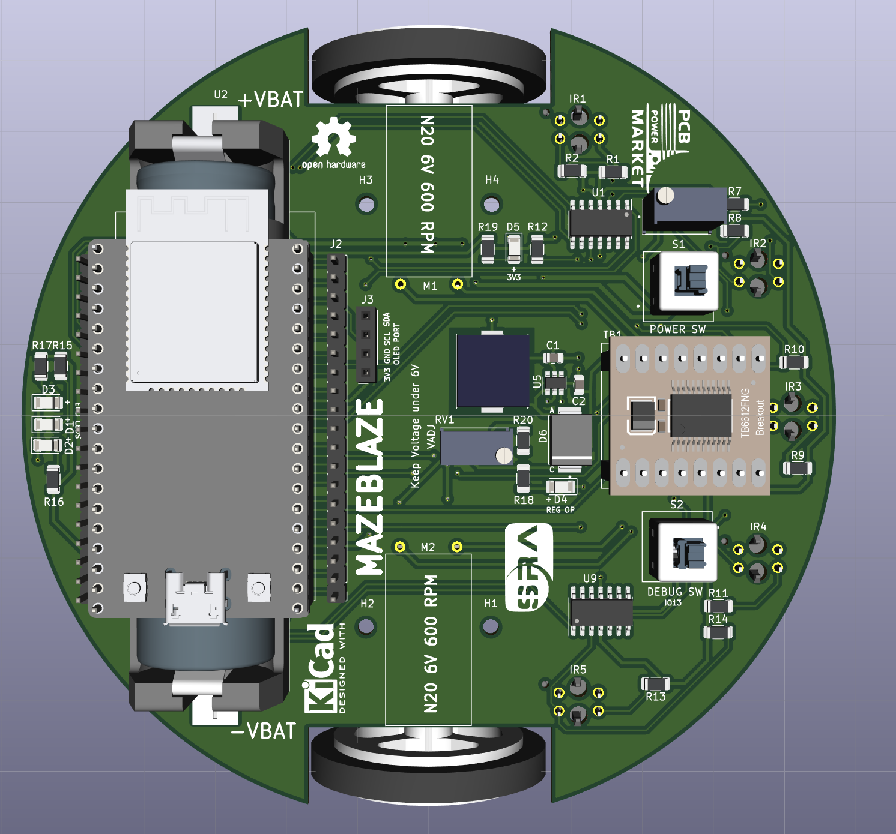
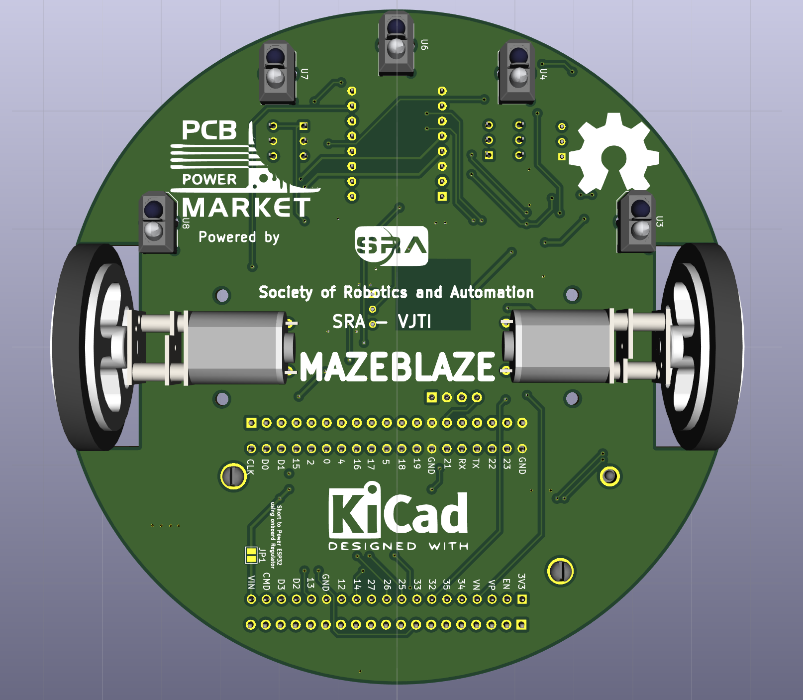
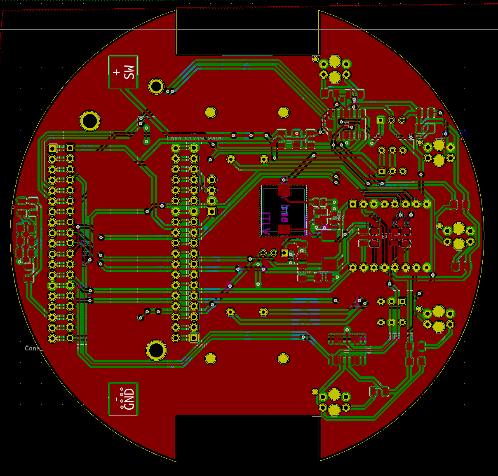
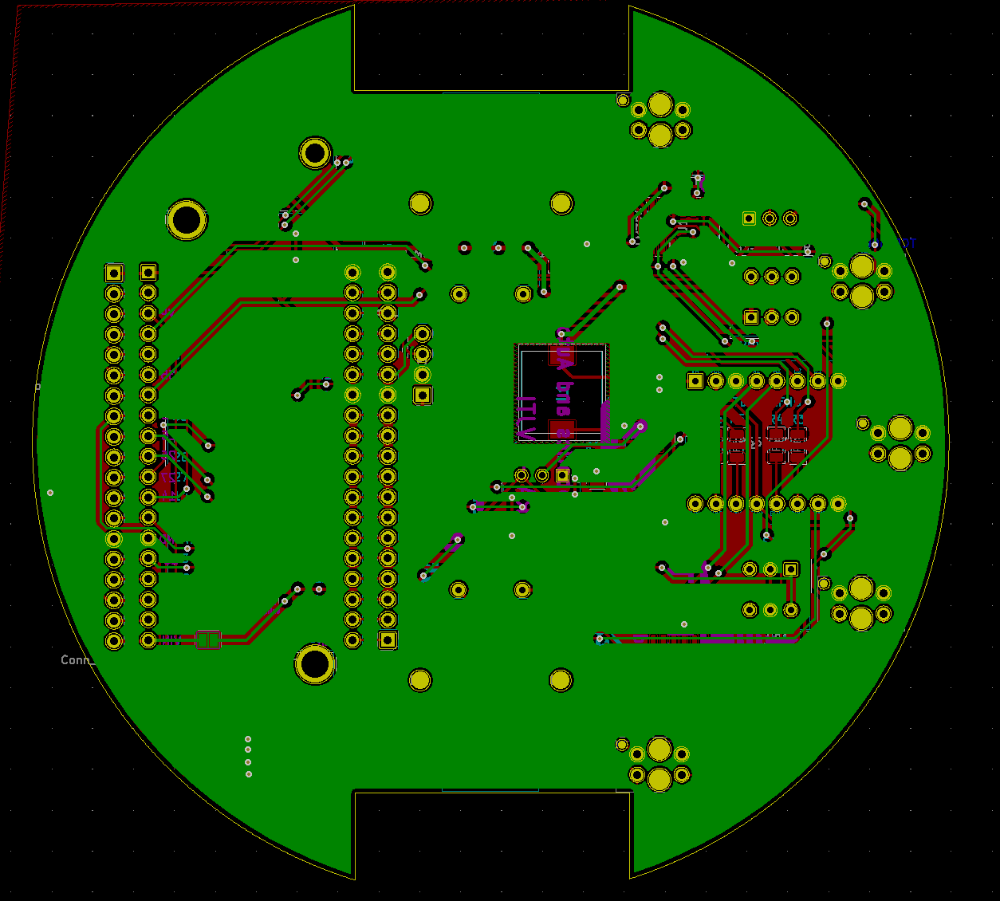
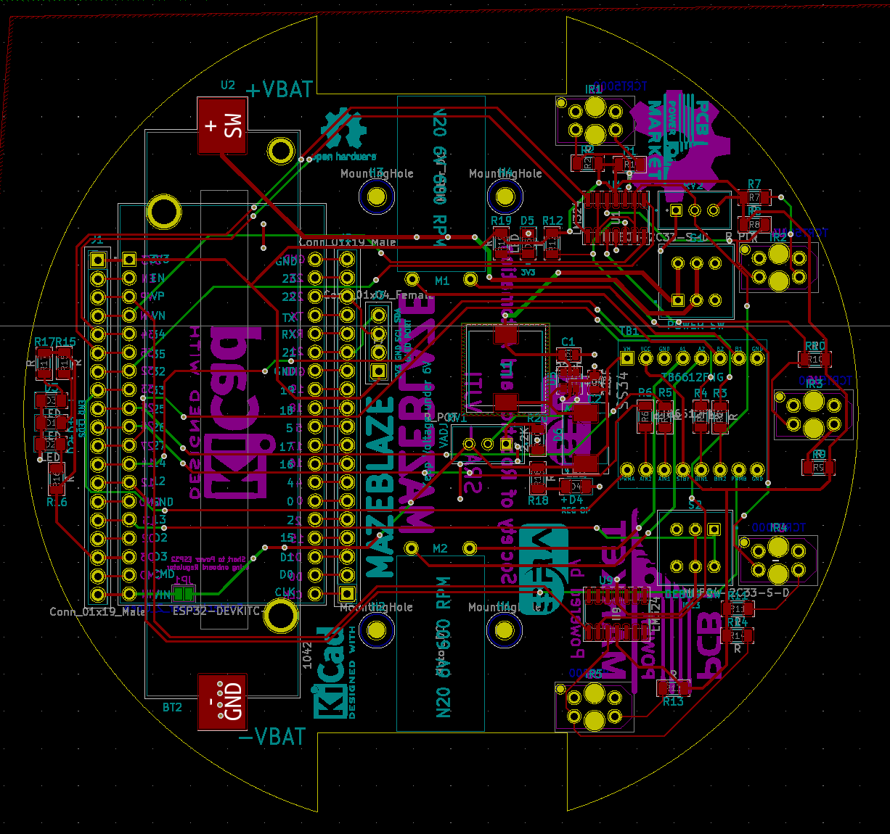

# MAZEBLAZE

This repository contains hardware design files for the MAZEBLAZE Bot.This project is in developement and is not ready for final release.

It uses -
* TRCT5000 IR Sensors for following the lines on the maze 
* TB6612FNG Motor Driver for controlling two N20 motors
* ESP32 for control and perform tasks at high speeds and accuracy

Following are some images of the PCB Design

* Top View

* Bottom View

* Front Copper Layer

* Bottom Copper Layer

* Routing 

